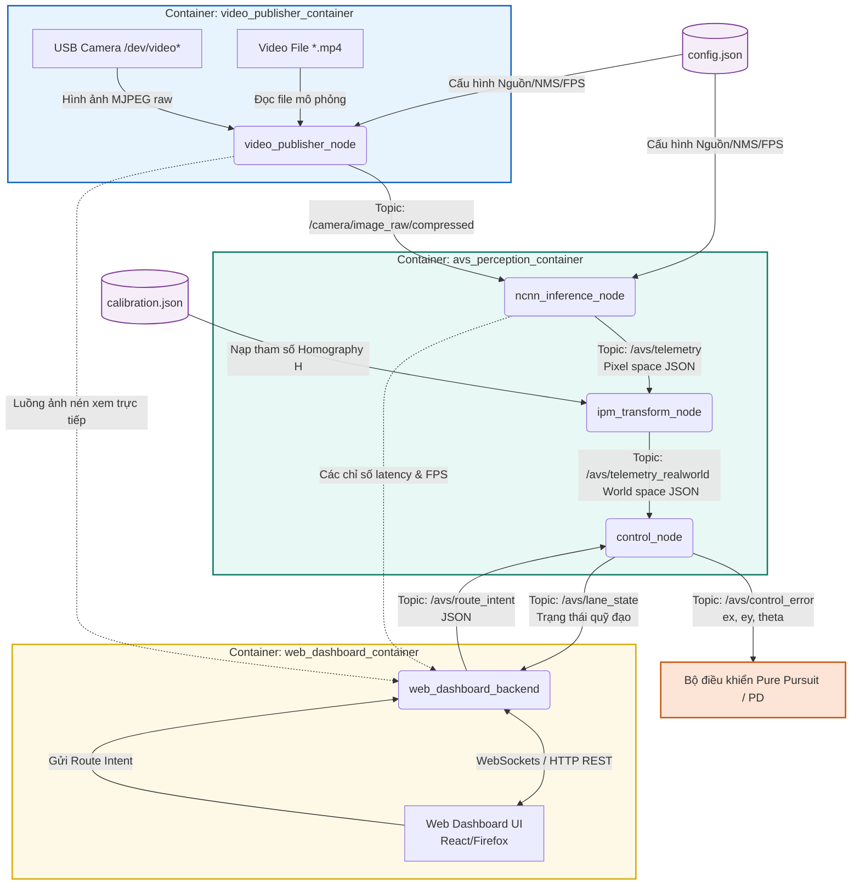

# Báo cáo Chi tiết: Kiến trúc Tổng quan của Hệ thống Hiện tại (AVS)

Báo cáo này tập trung phân tích chi tiết **Phần III, Mục 1: Kiến trúc tổng quan của hệ thống hiện tại** dựa trên tài liệu đặc tả hệ thống AVS. Tài liệu này làm rõ thiết kế sơ đồ khối tổng quan, cấu trúc phân chia container Docker, các node ROS2 Humble và luồng dữ liệu chính đi qua toàn bộ pipeline từ camera đến các tham số hình học đầu ra cuối cùng.

---

## 1. Sơ đồ khối tổng quan hệ thống (System Block Diagram)

Hệ thống thị giác thông minh xe tự hành (AVS) được thiết kế theo kiến trúc **phân tầng, bất đồng bộ và hướng dịch vụ** sử dụng middleware **ROS2 Humble**. Để đảm bảo tính độc lập và khả năng chạy ổn định tại biên (Edge Computing trên Raspberry Pi 5), toàn bộ hệ thống được chia thành 3 container Docker độc lập giao tiếp thông qua cơ chế DDS (Data Distribution Service) nội bộ (sử dụng cấu hình `network_mode: host` và `ipc: host`).

Dưới đây là sơ đồ khối chi tiết thể hiện các thành phần phần cứng, các node ROS2, tệp cấu hình và giao diện người dùng:



### Chi tiết vai trò các thành phần trong sơ đồ:
1. **`video_publisher_container`**:
   - Chịu trách nhiệm trực tiếp thu thập dữ liệu thị giác thô từ camera vật lý qua giao tiếp V4L2 hoặc giải mã video thử nghiệm `.mp4` cấu hình từ `config.json`.
   - Node `video_publisher_node` sử dụng cấu trúc đa luồng (Multi-threading): một luồng chuyên thu nhận frame với bộ đệm vòng kích thước $1$ để tránh trễ tích lũy, một luồng chuyên publish ảnh nén (`CompressedImage`) lên ROS2 để tiết kiệm tối đa băng thông.
2. **`avs_perception_container`**:
   - Trực tiếp chạy các node xử lý C++ hiệu năng cao gồm suy luận AI (`ncnn_inference_node`), biến đổi tọa độ hình học phẳng (`ipm_transform_node`) và tính toán sai số quỹ đạo (`control_node`).
   - Container này ánh xạ trực tiếp (bind mount) thư mục mã nguồn `ros2_ws`, thư mục mô hình lượng hóa `models`, và tệp hiệu chuẩn camera `config/calibration.json`.
3. **`web_dashboard_container`**:
   - Chạy một máy chủ Backend viết bằng Python FastAPI làm cầu nối dữ liệu (ROS2 Bridge). Backend này đăng ký nhận toàn bộ ảnh nén và các telemetry trạng thái để truyền tải trực tiếp lên giao diện Web thông qua kết nối WebSocket thời gian thực với độ trễ cực thấp.
   - Đồng thời, Dashboard cho phép người dùng thay đổi cấu hình runtime (như chế độ chạy, ngưỡng AI, hoặc hiệu chuẩn IPM trực tiếp) và truyền lệnh rẽ hoặc chuyển làn (`route_intent`) xuống hệ thống.

---

## 2. Luồng dữ liệu chính của hệ thống (Core Data Flow)

Dữ liệu hình ảnh được xử lý tuần tự qua từng khối trong một vòng lặp kín (control loop) với tần số tối đa đạt từ $30\text{ Hz}$ đến $45\text{ Hz}$ tùy thuộc vào độ phân giải ảnh và số luồng CPU được cấp phát cho mô hình AI.

Sơ đồ sau đây minh họa các bước biến đổi dữ liệu từ dạng ma trận điểm ảnh gốc (Pixel Space) sang dạng tọa độ thực (World Space) và cuối cùng là các sai số điều khiển:

```
[Hình ảnh Camera]
       │ (Giải mã ảnh MJPEG / Đọc file MP4)
       ▼
[sensor_msgs/msg/CompressedImage] (Topic: /camera/image_raw/compressed)
       │
       ├─► [ncnn_inference_node] (Inference YOLO INT8 + Trích contour mặt nạ)
       │         │
       │         ▼
       │   [std_msgs/msg/String] (Topic: /avs/telemetry - Tọa độ Pixel 2D)
       │         │
       │         ▼
       └─► [ipm_transform_node] (Nhân ma trận Homography H + Quét lát cắt + Khớp SVD)
                 │
                 ▼
           [std_msgs/msg/String] (Topic: /avs/telemetry_realworld - Tọa độ thực mm)
                 │
                 ▼
           [control_node] (Hòa trộn quỹ đạo Spatial Blending + Trajectory Management)
                 │
                 ├─► [std_msgs/msg/String] (Topic: /avs/control_error - Sai số ex, ey, theta)
                 │         │
                 │         └─► Phục vụ trực tiếp cho downstream Pure Pursuit/PD
                 │
                 └─► [std_msgs/msg/String] (Topic: /avs/lane_state - Debug & Web Monitoring)
```

### Phân tích chi tiết từng công đoạn biến đổi dữ liệu:

#### Bước 2.1: Thu nhận và Truyền tải Ảnh nén (Image Capture & Transport)
- Đầu vào là luồng video thô từ USB camera (cấu hình định dạng nén MJPEG để giảm tải bus USB và giảm băng thông truyền nhận) hoặc file video thử nghiệm.
- Node `video_publisher_node` publish ảnh qua topic `/camera/image_raw/compressed`. Việc sử dụng ảnh nén (JPEG) thay vì ảnh RAW giúp giảm tải lưu lượng mạng cực lớn khi truyền hình ảnh từ xe về Laptop phát triển phục vụ giám sát từ xa.

#### Bước 2.2: Suy luận AI và Trích xuất đa giác trong hệ ảnh (Inference & Pixel Space Telemetry)
- Node `ncnn_inference_node` đăng ký subcribe ảnh nén, giải nén ảnh thành cấu trúc `cv::Mat` bằng `cv_bridge`.
- Ảnh được chuyển đổi định dạng và đưa vào thư viện **NCNN** tối ưu hóa bằng tập lệnh NEON trên nhân ARM64 của Pi 5. Mô hình phân vùng nhị phân hóa các lớp làn đường (`main-lane`, `other-lane`, `turn-lane`) và vạch kẻ đường (`solid-white`, `solid-yellow`, `dashed-white`, `dashed-yellow`).
- Với mỗi đối tượng phát hiện được, node thực hiện thuật toán tìm đường biên (`cv::findContours`) để rút trích các đa giác (polygon) biểu diễn vùng phân vùng.
- Dữ liệu đầu ra được đóng gói dưới dạng chuỗi JSON và publish lên topic `/avs/telemetry`. Schema JSON lúc này chứa các thông số ở không gian điểm ảnh (Pixel Space):
  - Nhãn lớp (`label`, `class_name`).
  - Độ tin cậy suy luận (`prob`).
  - Đa giác biên (`polygons` chứa danh sách điểm dạng $u, v$).
  - Chỉ số hiệu năng (độ trễ từng bước suy luận, FPS đầu vào, FPS xử lý).

#### Bước 2.3: Biến đổi IPM phẳng và Khớp đa thức thực địa (World Space Telemetry)
- Node `ipm_transform_node` đăng ký subscribe dữ liệu `/avs/telemetry` và đồng thời nạp tệp cấu hình `calibration.json`.
- Sử dụng ma trận Homography $H$ thu được từ quá trình hiệu chuẩn tĩnh để biến đổi từng điểm tọa độ pixel $(u, v)$ của các polygon sang tọa độ thực $(X, Y)$ tính bằng milimet trên mặt phẳng đường thông qua công thức IPM phẳng.
- Từ các đa giác thực địa, áp dụng phương pháp **quét lát cắt trung vị (Midpoint Sweep Method)** dọc theo trục dọc $Y$ (hoặc trục ngang $X$ đối với làn rẽ) để trích xuất đường tâm làn đường rời rạc (Centerline Waypoints).
- Khớp các điểm centerline bằng đa thức bậc 3 ($x(y) = a_3y^3 + a_2y^2 + a_1y+a_0$ hoặc $y(x) = b_3x^3 + b_2x^2 + b_1x+b_0$) bằng thuật toán SVD để có được hệ số biểu diễn đường cong làn đường mượt mà.
- Dữ liệu được đóng gói thành JSON thực địa và publish lên topic `/avs/telemetry_realworld`.

#### Bước 2.4: Quy hoạch quỹ đạo và Trích xuất tham số sai số đầu ra (Geometry Parameter Extraction)
- Node `control_node` đăng ký subscribe `/avs/telemetry_realworld` và `/avs/route_intent` (từ giao diện người dùng).
- Dựa trên ý định đường đi hiện tại (`route_intent`), thuật toán **Trajectory Manager** quyết định lựa chọn làn đường mục tiêu để bám.
- Quỹ đạo bám làn được làm mượt qua các frame bằng thuật toán trộn động học theo khoảng cách (**Spatial Blending**) để chống hiện tượng rung lắc hình học cục bộ do mask của mô hình phân vùng thay đổi nhỏ theo từng frame.
- Quỹ đạo mượt cuối cùng (Active Trajectory) được sử dụng để trích xuất sai số điều khiển tại điểm nhìn trước (Look-ahead Point):
  - **`epsilon_x_mm`** (Sai số lệch ngang): Khoảng cách lệch trái/phải từ xe đến tâm làn đường tại vị trí mục tiêu.
  - **`epsilon_y_mm`** (Sai số dọc/Khoảng cách xem trước): Khoảng cách từ đầu xe đến điểm bám đuổi trên làn.
  - **`theta_rad`** (Sai số góc hướng): Góc lệch giữa hướng đầu xe (trục Y) và tiếp tuyến của quỹ đạo.
- Ba tham số hình học này được đóng gói và publish lên topic `/avs/control_error`. Đây là đầu ra cuối cùng của hệ thống thị giác máy tính AVS, cung cấp dữ liệu tức thời và tin cậy cho các thuật toán điều khiển phía dưới (Downstream Control như Pure Pursuit trên Pi hoặc bộ chấp hành trên ESP32).
- Node cũng xuất dữ liệu debug `/avs/lane_state` chứa quỹ đạo hiển thị để vẽ đè lên camera trên Dashboard.

---

## 3. Đặc điểm nổi bật của thiết kế kiến trúc hiện tại

Hệ thống AVS sở hữu các ưu điểm thiết kế quan trọng nhờ vào cấu trúc tổng quan này:
1. **Phân tách trách nhiệm rõ ràng (Decoupled Pipeline)**: Việc phân rã từ Video Stream -> Pixel Telemetry -> World Telemetry -> Control Error giúp cô lập lỗi cực tốt. Khi phát hiện quỹ đạo bị rung giật hoặc lệch hướng, lập trình viên có thể xác định ngay lỗi nằm ở khâu nhận diện (AI), khâu hiệu chuẩn (IPM) hay khâu làm mượt (Control Node).
2. **Khả năng quan sát thời gian thực (Observability)**: Nhờ giao tiếp dạng JSON qua các topic ROS2, dashboard web có thể trực tiếp lấy dữ liệu ở bất kỳ tầng nào để vẽ đồ thị, đo đạc độ trễ chi tiết từng phần (`bridge_latency`, `inference_latency`, `post_processing_latency`) mà không cần chèn mã nguồn đo đạc phức tạp vào các node xử lý lõi.
3. **Độ trễ thấp và Hiệu năng cao**: Toàn bộ luồng xử lý chính được viết bằng C++ và biên dịch tối ưu hóa phần cứng ARM64. Việc đóng gói dữ liệu dạng danh sách đa giác tối giản thay vì truyền tải ma trận nhị phân (binary mask tensor) qua các topic ROS2 giúp tiết kiệm bộ nhớ RAM và băng thông CPU, cho phép hệ thống chạy mượt mà ngay trên CPU Raspberry Pi 5 mà không bị nghẽn hàng đợi (Input Queue congestion).
