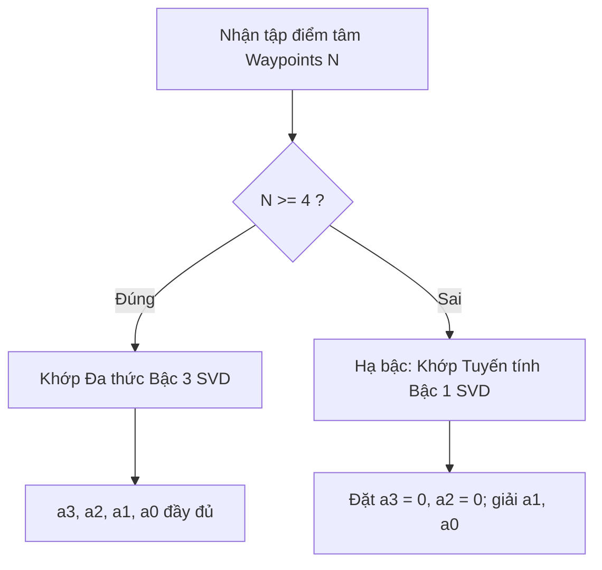

# Báo cáo Chi tiết: Thiết kế Thuật toán trong Từng tầng (AVS)

Báo cáo này tập trung phân tích chi tiết **Phần III, Mục 6: Thiết kế thuật toán trong từng tầng** dựa trên mã nguồn C++ của package `avs_perception`. Tài liệu này hệ thống hóa toàn bộ logic xử lý toán học và thuật toán từ khâu giải mã ảnh, chạy mô hình AI phân đoạn, bám vết đối tượng, biến đổi IPM Homography, khớp đa thức SVD, làm mượt Spatial Blending, đến trích xuất sai số điều khiển bám làn.

---

## 1. Tổng quan Kiến trúc Ba tầng Thuật toán của AVS

Hệ thống thị giác máy tính AVS được chia làm 3 tầng thuật toán xử lý tuần tự, mỗi tầng đảm nhiệm một nhiệm vụ chuyển đổi không gian dữ liệu riêng biệt:

```
[Ảnh Đầu Vào 2D] ──► TẦNG 1: PERCEPTION & TRACKING (Không gian ảnh Pixel)
                               │ (JSON Telemetry: Polygons 2D)
                               ▼
                    TẦNG 2: IPM & CURVE FITTING (Không gian thực mm)
                               │ (JSON Telemetry: Waypoints + Polynomial)
                               ▼
                    TẦNG 3: PLANNING & SMOOTHING (Không gian điều khiển)
                               │ (JSON Control Error: ex, ey, theta)
                               ▼
                         [Điều Khiển Lái]
```

---

## 2. Chi tiết Thuật toán Tầng 1: Perception & Tracking (Không gian ảnh)

Tầng này thu nhận khung hình và trích xuất thông tin đối tượng dưới dạng hộp bao (Bounding Box) và đa giác bao quanh vùng phân vùng (Contour Polygons) trong hệ tọa độ Pixel $2\text{D}$.

### Bước 2.1: Tiền xử lý ảnh (Preprocessing)
- **Chuẩn hóa hệ màu:** Ảnh thô từ camera (BGR) được chuyển đổi sang định dạng màu RGB.
- **Resize & Padding:** Ảnh gốc $640 \times 480$ được co dãn (resize) về kích thước mạng $320 \times 320$, giữ nguyên tỷ lệ gốc bằng cách chèn viền đen (padding) để tránh làm méo dạng làn đường.
- **Normalize:** Chia giá trị điểm ảnh cho $255.0$ để chuẩn hóa về khoảng $[0.0, 1.0]$.

### Bước 2.2: Suy luận AI YOLO Seg qua NCNN
- Mạng NCNN giải mã đầu ra của YOLO Seg bao gồm các bản đồ mặt nạ nguyên mẫu (Prototype Masks $P \in \mathbb{R}^{32 \times 80 \times 80}$) và các hệ số mặt nạ (Mask Coefficients $C \in \mathbb{R}^{32}$) cho mỗi đối tượng.
- **Tái tạo mặt nạ thô:** 
  $$M_{raw}(x,y) = \sum_{i=1}^{32} C_i \cdot P_i(x,y)$$
- **Nhị phân hóa:** Áp dụng hàm kích hoạt Sigmoid và ngưỡng lọc xác suất $\tau = 0.5$ để tạo mặt nạ nhị phân cục bộ trong vùng Bounding Box ROI:
  $$M_{bin}(x,y) = \begin{cases} 1, & \sigma(M_{raw}(x,y)) \ge 0.5 \\ 0, & \sigma(M_{raw}(x,y)) < 0.5 \end{cases}$$

### Bước 2.3: Trích xuất đa giác tối giản (Contour Extraction)
- Thay vì truyền toàn bộ ma trận ảnh nhị phân $M_{bin}$ qua mạng ROS2 (rất tốn băng thông), node áp dụng thuật toán tìm đường biên ngoài **`cv::findContours`** với cấu hình:
  - Kiểu truy xuất: `cv::RETR_EXTERNAL` (chỉ lấy đường biên bao ngoài cùng).
  - Phương pháp xấp xỉ: `cv::CHAIN_APPROX_SIMPLE` (loại bỏ các điểm trùng lặp trên đường thẳng, ví dụ đường thẳng chỉ lưu 2 điểm đầu và cuối).
  - Kết quả thu được là mảng đa giác `polygons` (danh sách các điểm pixel $[u, v]$).

### Bước 2.4: Bám vết đối tượng Greedy 2D IoU Tracking
- Duy trì danh sách vết bám `active_tracks`. Ở mỗi frame, tính toán chỉ số giao chéo IoU (Intersection over Union) giữa hộp bao của phát hiện mới $D_i$ và hộp bao của vết bám cũ $T_j$:
  $$\text{IoU}(D_i, T_j) = \frac{\text{Area}(D_i \cap T_j)}{\text{Area}(D_i \cup T_j)}$$
- Sắp xếp các cặp khớp ứng viên theo thứ tự IoU giảm dần. Gán phát hiện mới cho vết cũ nếu $\text{IoU} \ge 0.3$.
- **Xử lý vết bám:**
  - Nếu không khớp được vết cũ: Tăng `lost_count` lên 1. Nếu `lost_count > 5`, giải phóng vết bám này khỏi bộ nhớ.
  - Dành cho phát hiện mới không khớp: Khởi tạo vết bám mới với mã ID duy nhất (ví dụ: `main_lane_` + `next_track_id_`).

---

## 3. Chi tiết Thuật toán Tầng 2: IPM & Curve Fitting (Không gian thực mm)

Tầng này chuyển đổi đa giác pixel sang không gian thực địa và khớp chúng thành các đường cong toán học mượt mà đại diện cho tim đường.

### Bước 3.1: Biến đổi góc nhìn ngược (Inverse Perspective Mapping)
Với mỗi điểm ảnh $p = [u, v, 1]^T$ trên đa giác, áp dụng ma trận Homography hiệu chuẩn tĩnh $H \in \mathbb{R}^{3 \times 3}$:
$$\begin{bmatrix} X_{raw} \\ Y_{raw} \\ w \end{bmatrix} = \begin{bmatrix} H_{00} & H_{01} & H_{02} \\ H_{10} & H_{11} & H_{12} \\ H_{20} & H_{21} & H_{22} \end{bmatrix} \begin{bmatrix} u \\ v \\ 1 \end{bmatrix}$$
Khử hệ số tỉ lệ phối cảnh $w$ thu được tọa độ thực thế giới thực (mm) trên mặt đường:
$$X = \frac{H_{00}u + H_{01}v + H_{02}}{H_{20}u + H_{21}v + H_{22}}, \quad Y = \frac{H_{10}u + H_{11}v + H_{12}}{H_{20}u + H_{21}v + H_{22}}$$
Kết quả lưu vào trường `polygons_real_world` trong cấu trúc JSON.

### Bước 3.2: Kỹ thuật quét lát cắt trung điểm (Midpoint Sweep Method)
Để tìm trục đường tâm của làn đường, hệ thống thực hiện quét cắt lớp đa giác thực địa:
1. **Quét dọc làn thẳng (Y-sweep cho `main-lane`, `other-lane`):**
   - Quét từ $Y_{min} = 300\text{ mm}$ đến $Y_{max} = 1500\text{ mm}$ với bước nhảy $100\text{ mm}$.
   - Tại mỗi lát cắt $y_i$, tìm giao điểm biên trái $x_{left}$ và biên phải $x_{right}$ của đa giác. Tính trung điểm:
     $$x_{mid}(y_i) = \frac{x_{left}(y_i) + x_{right}(y_i)}{2}$$
2. **Quét ngang làn rẽ (X-sweep cho `turn-lane`):**
   - Quét dọc theo trục $X$ với bước nhảy $100\text{ mm}$, tính trung điểm dọc:
     $$y_{mid}(x_i) = \frac{y_{bottom}(x_i) + y_{top}(x_i)}{2}$$
3. **Lọc nhiễu lát cắt bị phình (Outlier Filtering):**
   - Tính toán bề rộng cục bộ của lát cắt $W_i = |x_{right} - x_{left}|$. Tính toán bề rộng trung vị (median width) của toàn làn. Lát cắt nào có $W_i > 1.3 \times \text{Median\_Width}$ sẽ bị Prune (loại bỏ) vì là vùng nhiễu phân vùng bị loang.

### Bước 3.3: Khớp đa thức SVD (Least-Squares Polynomial Fitting)
Hệ thống giải phương trình bình phương tối thiểu để khớp tập hợp các điểm tâm rời rạc thành đa thức bậc 3. Để chống lỗi số trị và quá khớp (overfitting) khi số điểm quan sát quá ít, hệ thống áp dụng cơ chế **Fallback hạ bậc thông minh**:



- **Khi $N \ge 4$ (Khớp bậc 3):**
  Lập ma trận hệ phương trình $A \cdot c = B$ với:
  $$A = \begin{bmatrix} y_1^3 & y_1^2 & y_1 & 1 \\ y_2^3 & y_2^2 & y_2 & 1 \\ \vdots & \vdots & \vdots & \vdots \\ y_N^3 & y_N^2 & y_N & 1 \end{bmatrix}, \quad B = \begin{bmatrix} x_1 \\ x_2 \\ \vdots \\ x_N \end{bmatrix}, \quad c = \begin{bmatrix} a_3 \\ a_2 \\ a_1 \\ a_0 \end{bmatrix}$$
  Giải tìm vector hệ số $c$ bằng phân tích trị riêng suy biến: `cv::solve(A, B, C, cv::DECOMP_SVD)`.
- **Khi $2 \le N < 4$ (Khớp bậc 1):**
  Hạ bậc đa thức thành đường thẳng $x(y) = a_1y + a_0$. Đặt $a_3 = 0$ và $a_2 = 0$. Thiết lập ma trận $A$ kích thước $N \times 2$ và giải tương tự bằng SVD. Điều này ngăn chặn hiện tượng đa thức bậc cao bị uốn cong vô lý ở vùng biên khi thiếu dữ liệu.

---

## 4. Chi tiết Thuật toán Tầng 3: Planning & Smoothing (Không gian điều khiển)

Tầng này thực hiện làm mượt quỹ đạo theo thời gian và trích xuất các sai số hình học mục tiêu cuối cùng tại điểm nhìn trước động.

### Bước 4.1: Hòa trộn quỹ đạo không gian - thời gian (Spatial-Temporal Blending)
Nhằm triệt tiêu hoàn toàn sự rung lắc quỹ đạo giữa các frame liên tiếp, node `control_node` lưu quỹ đạo đã cam kết ở frame trước $P_{prev}$ và thực hiện nội suy trộn tuyến tính với quỹ đạo ứng viên mới $P_{candidate}$.

#### Công thức thiết lập trọng số trộn động:
- Lấy độ tin cậy nhận diện $C \in [0.0, 1.0]$ của làn mục tiêu.
- Tính toán giới hạn trọng số trộn dựa trên độ tin cậy:
  $$w_{cur,max} = 0.2 + 0.7 \cdot C$$
  $$w_{cur,min} = 0.05 + 0.15 \cdot C$$
- Trọng số trộn vị trí $w_{cur}(s)$ thay đổi tuyến tính dọc theo chiều dài cung quỹ đạo $s$ (mm) từ đầu xe hướng ra xa:
  $$\alpha(s) = \min\left(1.0, \frac{s}{L_{trans}}\right) \quad \text{(với } L_{trans} = 3000\text{ mm)}$$
  $$w_{cur}(s) = w_{cur,min} + \alpha(s) \cdot (w_{cur,max} - w_{cur,min})$$
- **Hòa trộn điểm:**
  $$P_{blended}(s) = (1 - w_{cur}(s)) \cdot P_{prev}(s) + w_{cur}(s) \cdot P_{candidate}(s)$$

#### Ý nghĩa vật lý của Blending động:
- **Tại vùng gần xe ($s \approx 0$):** $w_{cur}(s)$ đạt cực tiểu ($w_{cur,min} \approx 0.05 - 0.20$), nghĩa là quỹ đạo bám sát hoàn toàn vào frame cũ. Đầu xe cực kỳ ổn định, không bị đảo lái liên tục do nhiễu camera.
- **Tại vùng xa xe ($s \ge 3000\text{ mm}$):** $w_{cur}(s)$ đạt cực đại ($w_{cur,max} \approx 0.20 - 0.90$), nghĩa là quỹ đạo bám nhanh theo quan sát mới nhất. Đuôi quỹ đạo phản ứng linh hoạt với các khúc cua gắt hoặc chướng ngại vật xuất hiện phía xa.

### Bước 4.2: Tái mẫu đồng đều (Normalization / Resampling)
- Quỹ đạo hòa trộn được tái mẫu rời rạc ở bước cố định $100\text{ mm}$ dọc theo chiều dài cung bắt đầu từ gốc xe ($0.0$). Việc này đảm bảo khoảng cách giữa các Waypoints luôn đồng đều, tạo điều kiện thuận lợi cho việc nội suy điểm nhìn trước.

### Bước 4.3: Trích xuất sai số điều khiển tại điểm nhìn trước động (Look-ahead Point)
- Xác định khoảng cách nhìn trước động $L_d$ từ odom.
- Tìm điểm đích $P_{target}(x_{target}, y_{target})$ trên quỹ đạo bám làn mượt mà cách xe một khoảng bằng $L_d$:
  $$L_d = \sqrt{x_{target}^2 + y_{target}^2}$$
- **Sai số lệch ngang (Lateral Error - $e_x$):**
  $$e_x = x_{target}$$
- **Sai số dọc (Longitudinal Error - $e_y$):**
  $$e_y = y_{target}$$
- **Sai số góc hướng (Heading Error - $\theta$):**
  $$\theta = \operatorname{atan2}(x_{target}, y_{target})$$
- **Độ cong quỹ đạo (Curvature - $\kappa$):**
  Tính từ các hệ số đa thức tại vị trí gốc xe ($y=0$):
  $$\kappa \approx 2a_2$$
- Các sai số này được đóng gói phát ra topic `/avs/control_error`.
