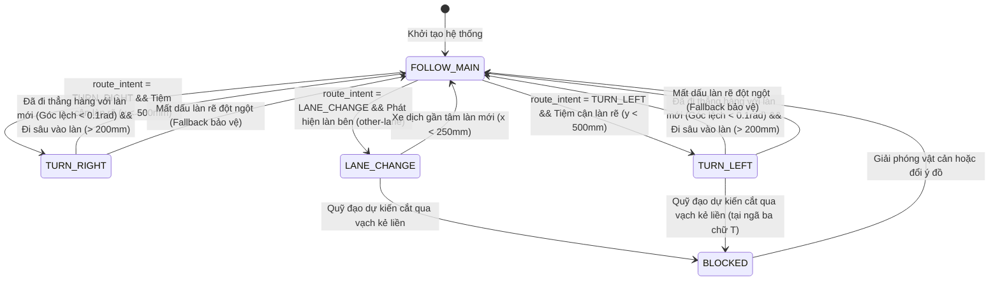

# Báo cáo Chi tiết: Logic Chọn Làn trong Phạm vi CV (AVS)

Báo cáo này tập trung phân tích chi tiết **Phần III, Mục 7: Logic chọn lane trong phạm vi CV** dựa trên mã nguồn C++ của node quyết định `/avs/control_node` (lớp `LaneErrorNode` và `TrajectoryManager`). Tài liệu này phân định rõ ranh giới chức năng của khối xử lý, mô tả máy trạng thái quyết định, các điều kiện chuyển đổi trạng thái và logic xử lý hành vi dựa trên ý đồ điều hướng.

---

## 1. Ranh giới Chức năng: Vai trò của Logic Chọn Làn

Một điểm tối quan trọng cần làm rõ trong kiến trúc hệ thống AVS là **vai trò giới hạn** của logic chọn làn nằm trong phạm vi Thị giác máy tính (CV):
- **Không phát lệnh điều khiển trực tiếp:** Khối chọn làn CV *không* trực tiếp sinh ra các tín hiệu điều khiển cơ cấu chấp hành vật lý như góc quay vô-lăng, mô-men xoắn động cơ, hay áp lực phanh. Nhiệm vụ điều khiển bám đuổi quỹ đạo thực tế được đảm nhiệm bởi một bộ điều khiển phản hồi vòng kín (ví dụ: bộ điều khiển Pure Pursuit, PID, hoặc MPC) chạy ở một node điều khiển độc lập hoặc chạy trực tiếp trên vi điều khiển ESP32 qua micro-ROS.
- **Quyết định quỹ đạo bám đuổi:** Vai trò duy nhất của khối này là phân tích dữ liệu quan sát đường đi, đối chiếu với ý định dẫn hướng (`route_intent`), và quyết định **làn đường mục tiêu nào và hệ thống điểm hình học nào** sẽ được lựa chọn để tính toán ra sai số hình học đầu ra ($e_x, e_y, \theta, \kappa$). 
- Nói cách khác, khối này hoạt động như một **Bộ điều hướng hình học**, đóng vai trò cầu nối quyết định làn đường mục tiêu để đưa ra sai số bám cho bộ điều khiển hạ tầng phía sau.

---

## 2. Máy Trạng thái Quyết định (Decision State Machine)

Để điều hướng xe tự hành qua các kịch bản giao thông phức tạp như đi thẳng, chuyển làn, tiếp cận ngã rẽ và rẽ hướng tại giao lộ, hệ thống duy trì một máy trạng thái quyết định bao gồm 6 trạng thái chính (`DecisionState`):

### Chi tiết các Trạng thái:
1. **`FOLLOW_MAIN` (Bám làn chính):** Trạng thái mặc định. Xe liên tục bám theo tim đường của làn đường đang chạy (`main-lane`).
2. **`TURN_RIGHT` (Rẽ phải):** Chuyển mục tiêu bám đuổi sang đường tâm của làn rẽ phải (`turn-lane`).
3. **`TURN_LEFT` (Rẽ trái):** Chuyển mục tiêu bám đuổi sang đường tâm của làn rẽ trái (`turn-lane`).
4. **`LANE_CHANGE` (Chuyển làn):** Chuyển mục tiêu sang bám làn đường liền kề (`other-lane`) bên trái hoặc bên phải.
5. **`BLOCKED` (Bị chặn hành vi):** Trạng thái an toàn. Kích hoạt khi có ý định rẽ hoặc chuyển làn nhưng quỹ đạo dự kiến bị chặn bởi vạch kẻ đường cấm đè (vạch liền).
6. **`RECOVERY` (Phục hồi mất làn):** Kích hoạt khi mất dấu làn mục tiêu tạm thời, bộ lọc dự phòng giữ quỹ đạo cũ trong vài chu kỳ trước khi tuyên bố lỗi mất làn hoàn toàn.

---

## 3. Các Điều kiện Chuyển đổi Trạng thái và Trình kích hoạt (Triggers)

Quá trình chuyển đổi trạng thái bám đường được kích hoạt dựa trên sự phối hợp giữa lệnh người dùng, khoảng cách hình học và kiểm tra an toàn đè vạch:

### 3.1. Tiếp nhận Ý định Dẫn hướng (`route_intent`)
Hệ thống đăng ký nhận tin nhắn `/avs/route_intent` từ Dashboard với các lệnh: `FOLLOW_MAIN`, `TURN_LEFT`, `TURN_RIGHT`, `LANE_CHANGE_LEFT`, `LANE_CHANGE_RIGHT`. Ý định này được lưu trữ và chốt (latch) lại để chuẩn bị cho quá trình kích hoạt hình học.

### 3.2. Điều kiện tiệm cận ngã rẽ (Turn Proximity Trigger)
Khi có ý định rẽ (`TURN_LEFT`/`TURN_RIGHT`), xe sẽ **không rẽ ngay lập tức** nếu ngã rẽ còn ở quá xa.
- Hệ thống liên tục đo khoảng cách dọc từ đầu xe tới điểm bắt đầu của làn rẽ mục tiêu (`turn_lane_cand`).
- Trạng thái rẽ chỉ được kích hoạt từ `FOLLOW_MAIN` sang `TURN_RIGHT`/`TURN_LEFT` khi khoảng cách dọc này nhỏ hơn ngưỡng tham số **`turn_proximity_mm`** (mặc định là $500\text{ mm}$):
  $$y_{turn\_start} < 500\text{ mm}$$

### 3.3. Kiểm tra Chặn bởi Vạch liền (Solid Marking Blockage Check)
Đây là tính năng an toàn để ngăn xe tự hành đè lên vạch cấm khi thực hiện chuyển làn hoặc rẽ tại ngã ba (đặc biệt là ngã ba chữ T):
- **Xây dựng quỹ đạo dự kiến (Tentative Trajectory):** Node mô phỏng thử nghiệm một quỹ đạo chuyển làn/rẽ đi từ làn hiện tại sang làn mục tiêu.
- **Duyệt vạch kẻ cấm:** Kiểm tra giao cắt giữa đa giác quỹ đạo dự kiến này với đa giác của các vạch kẻ liền phát hiện được (`solid-white`, `solid-yellow`).
- **Kích hoạt:** Nếu phát hiện quỹ đạo cắt qua vạch liền, hệ thống lập tức override trạng thái mục tiêu sang `BLOCKED` để bảo vệ, giữ xe chạy tiếp trong làn hiện tại thay vì thực hiện rẽ đè vạch cấm.

---

## 4. Điều kiện Hoàn thành và Hủy Nghiệm vụ (Maneuver Completion & Hysteresis)

Để kết thúc hành vi chuyển làn hoặc rẽ cua và đưa xe quay trở lại trạng thái chạy thẳng bình thường (`FOLLOW_MAIN`), hệ thống áp dụng các điều kiện kiểm tra biên độ hình học nghiêm ngặt:

### 4.1. Điều kiện hoàn thành rẽ cua (Turn Completion)
Khi xe đang trong trạng thái rẽ (`TURN_RIGHT` hoặc `TURN_LEFT`), hệ thống giám sát góc hướng của xe đối với làn rẽ mục tiêu:
1. **Độ song song:** Góc lệch giữa xe và làn mới phải nhỏ hơn ngưỡng **`theta_done_rad`** (mặc định $0.1\text{ rad}$ hay khoảng $5.7^\circ$), nghĩa là thân xe đã đi thẳng hàng với làn mới.
2. **Độ sâu:** Điểm bắt đầu của làn rẽ cũ đã lùi lại phía sau xe một khoảng vượt quá ngưỡng **`turn_done_mm`** (mặc định $200\text{ mm}$):
  $$y_{turn\_start} < -200\text{ mm}$$
- Khi cả hai điều kiện trên được thỏa mãn đồng thời, hệ thống xác nhận hoàn thành rẽ, chuyển trạng thái về `FOLLOW_MAIN` và tự động reset `route_intent` về `FOLLOW_MAIN`.

### 4.2. Điều kiện mất làn rẽ đột ngột (Turn Lane Lost Fallback)
Nếu đang trong quá trình rẽ cua gắt mà đột nhiên mô hình AI không phát hiện thấy làn rẽ mục tiêu nữa (`turn_lane_cand == nullptr`):
- Hệ thống lập tức kích hoạt bộ lọc bảo vệ: chuyển trạng thái khẩn cấp về `FOLLOW_MAIN` và reset intent. Xe sẽ quay lại bám theo làn chính còn nhìn thấy để ngăn ngừa mất kiểm soát hướng đi.

### 4.3. Điều kiện hoàn thành chuyển làn (Lane Change Completion)
Khi đang chuyển làn (`LANE_CHANGE`), xe thực hiện chuyển đổi bám từ làn chính cũ sang làn kế bên. Hành vi này hoàn thành khi:
- Xe tiến sát vào tâm làn mới: Khoảng lệch ngang của làn mới so với gốc xe nhỏ hơn $250\text{ mm}$:
  $$|x_{target\_new}| < 250\text{ mm}$$
- Hoặc kiểm tra vị trí tương đối giữa xe và hai làn (làn chính cũ đã bị đẩy hẳn sang bên đối diện với khoảng cách $> 600\text{ mm}$).
- Hệ thống xác nhận chuyển làn thành công, ghi nhận làn mới làm làn chính (`FOLLOW_MAIN`).
